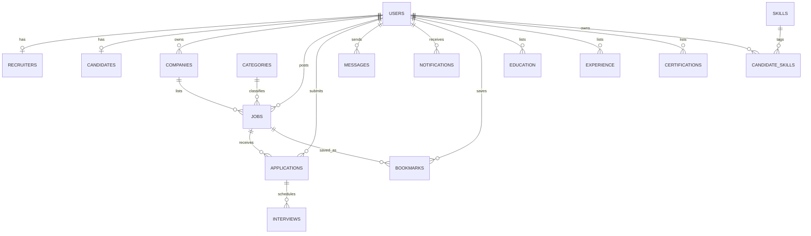

# ER Diagram

```mermaid
erDiagram
  USERS ||--o| RECRUITERS : has
  USERS ||--o| CANDIDATES : has
  USERS ||--o{ COMPANIES : owns
  USERS ||--o{ JOBS : posts
  COMPANIES ||--o{ JOBS : lists
  CATEGORIES ||--o{ JOBS : classifies
  USERS ||--o{ APPLICATIONS : submits
  JOBS ||--o{ APPLICATIONS : receives
  APPLICATIONS ||--o{ INTERVIEWS : schedules
  USERS ||--o{ MESSAGES : sends
  USERS ||--o{ NOTIFICATIONS : receives
  USERS ||--o{ BOOKMARKS : saves
  JOBS ||--o{ BOOKMARKS : saved_as
  USERS ||--o{ EDUCATION : lists
  USERS ||--o{ EXPERIENCE : lists
  USERS ||--o{ CERTIFICATIONS : lists
  SKILLS ||--o{ CANDIDATE_SKILLS : tags
  USERS ||--o{ CANDIDATE_SKILLS : owns
```
